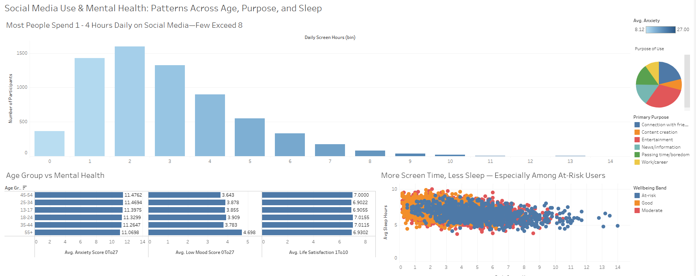

# Social Media Use & Mental Health

A Tableau dashboard exploring how social media usage patterns
relate to mental health and wellbeing across age groups.

🔗 **[View interactive dashboard on Tableau Public](https://public.tableau.com/app/profile/mark.ferrary/viz/SocialMediaUseMentalHealth/Dashboard1)**

## Key Insights
- **Screen time:** Most participants spend 1-4 hours daily on social media; very few exceed 8 hours.
- **Age & mental health:** Anxiety and life satisfaction stay fairly consistent across age groups, but low mood is notably higher among those 55+.
- **Purpose of use:** Usage is fairly evenly split across connection, entertainment, content creation, news, boredom, and work/career purposes.
- **Screen time & sleep:** Higher daily screen time is associated with lower average sleep, especially among participants in the "At-risk" wellbeing band.

## Data
- **Cleaning script:** [`social_media_clean.sql`](social_media_clean.sql)
- **Cleaned dataset:** [`social_media_clean.csv`](social_media_clean.csv)

## Tools
- MySQL Workbench for data cleaning
- Tableau (Public Edition) for visualization
